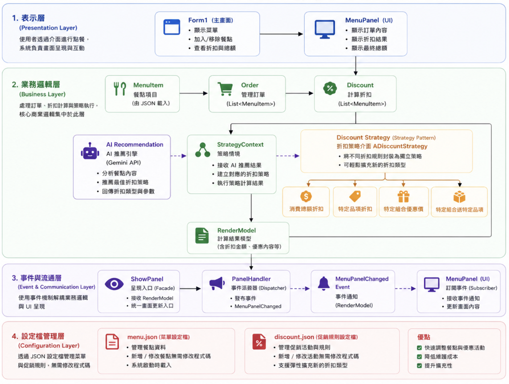

# AI智慧POS點餐與優惠推薦系統

## 簡介
本點餐系統採用模組化架構，將AI決策、折扣策略、訂單流程與 UI顯示分離，各模組透過明確的資料流協作，以提升系統的可維護性與擴充性。

## 架構圖

## 各模組功能

### AI Module

負責與 Gemini API 互動，分析使用者點餐內容並推薦最適合的折扣方案。AI 並不直接計算折扣，而是回傳 Discount Type 與相關參數，交由策略模組執行。

### Strategy Module

採用 Strategy Pattern 將不同優惠活動封裝為獨立策略，由 StrategyContext 根據 AI 建議或使用者選擇，自動建立並執行對應的折扣策略，避免大量 if-else 判斷並且擴充性高。

### Data Flow

使用者選擇餐點後，由 Order 統一管理 List<MenuItem>，再交由 Discount 模組計算優惠，最後將結果傳遞至 ShowPanel 更新畫面，形成完整的訂單處理流程。

### UI Flow Handling

透過 PanelHandler 管理動態 UI 更新與事件傳遞，將畫面呈現與商業邏輯解耦，使前端介面維持單純的顯示責任。

## ✨專案亮點
- 整合 **Gemini API**，透過 AI 分析使用者點餐內容並推薦最佳折扣策略。
- 實作基於 **Reflection** 的 AI Agent，支援 Function 動態探索與呼叫，提升 AI 工具擴充能力。
- 採用 **Strategy Pattern** 將多種折扣邏輯封裝為獨立策略，降低耦合並提升系統擴充性。
- 採用 **Event-driven** 架構分離訂單流程、折扣計算與 UI 更新，提升系統可維護性。
- 採用 **JSON Configuration** 外部化管理菜單與促銷規則，新增餐點或優惠活動僅需修改設定檔，無須重新編譯程式。
